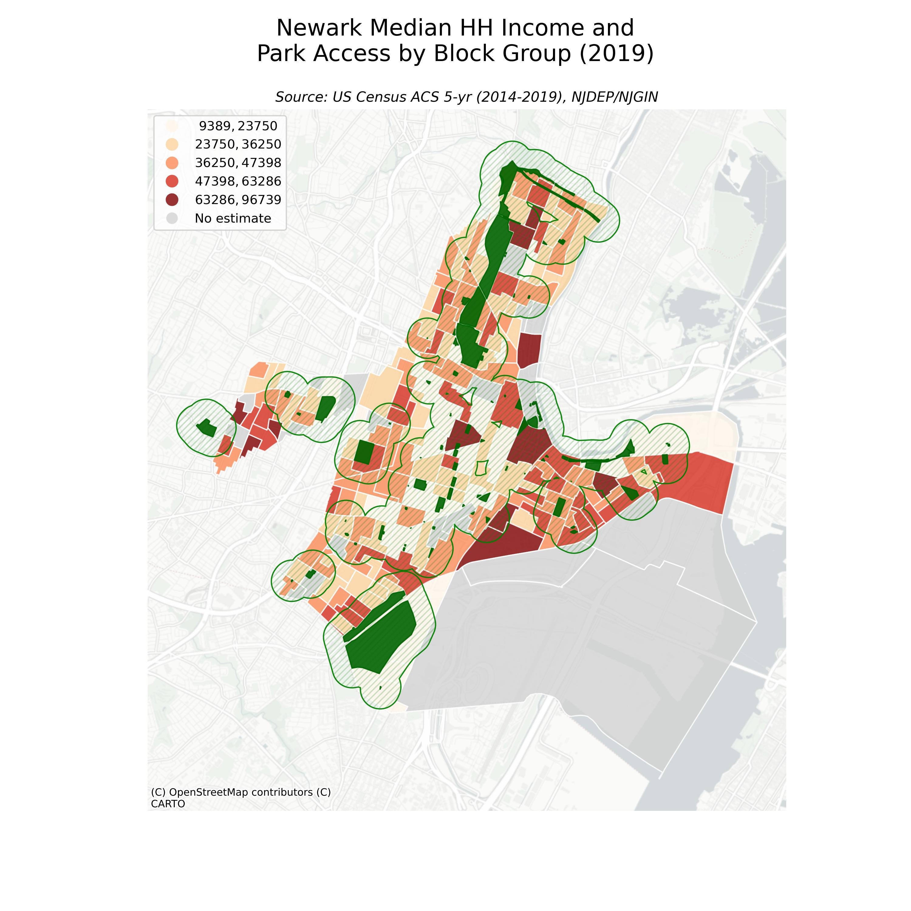
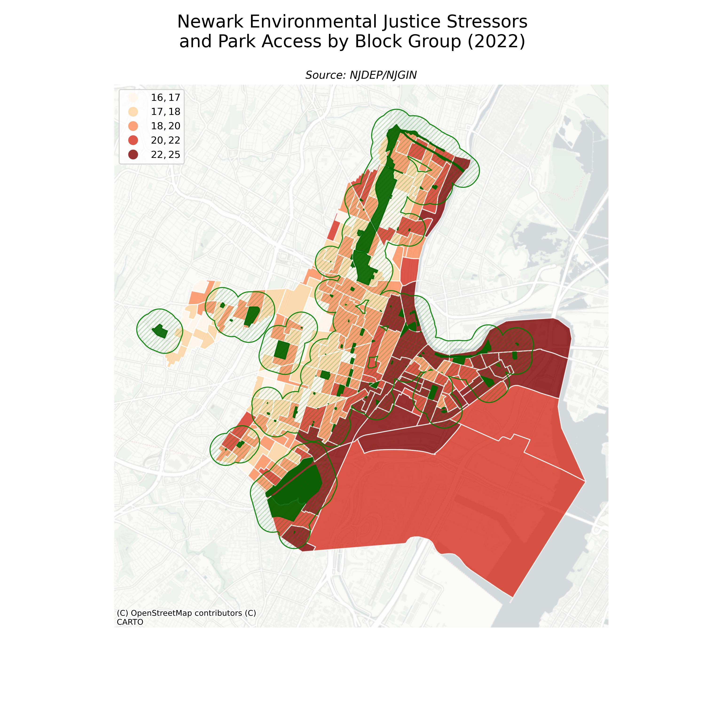

# Maggie Loesch
Fall 2023
Intro to GIS For Public Informatics at Bloustein School of Planning and Public Policy - Rutgers University
Prof. Wenwen Zhang

<b> Research Question: Are there patterns in Median Household Income relating to living in an area with greater Environmental Justice Stressors, and how do these relate to proximity to parks?</b>
Findings: Due to Newark International Airport, EJ issues abound in Newark, NJ. There is a distinct pattern of more EJ issues closer to the airport, and in households with lower incomes being more likely to live in places with more environmental justice issues. There did not seem to be patterns relating to proximity to parks (defined as a 1/4 mile buffer from parks).

The following maps showing 2019 Median Household Income, Environmental Justice Stressors, Parks, and a 1/4 mi buffer around parks in Newark, NJ.Income data comes from the <b>American Community Survey 5-yr Estimates (2014-2019).</b> Environmental Justice Stressor tallies come from the <b>New Jersey Dept. of Environmental Protection's Environmental Justice Law Combined Stressor Summary</b> dataset available on the NJ Geographic Information Network. Both datasets were filtered to Newark City before downloaded, and downloaded in GeoJSON format. 

<b>The map below is interactive.<b>
<iframe src='newarkEJ.html' width = '1100' height = '800'></iframe>

